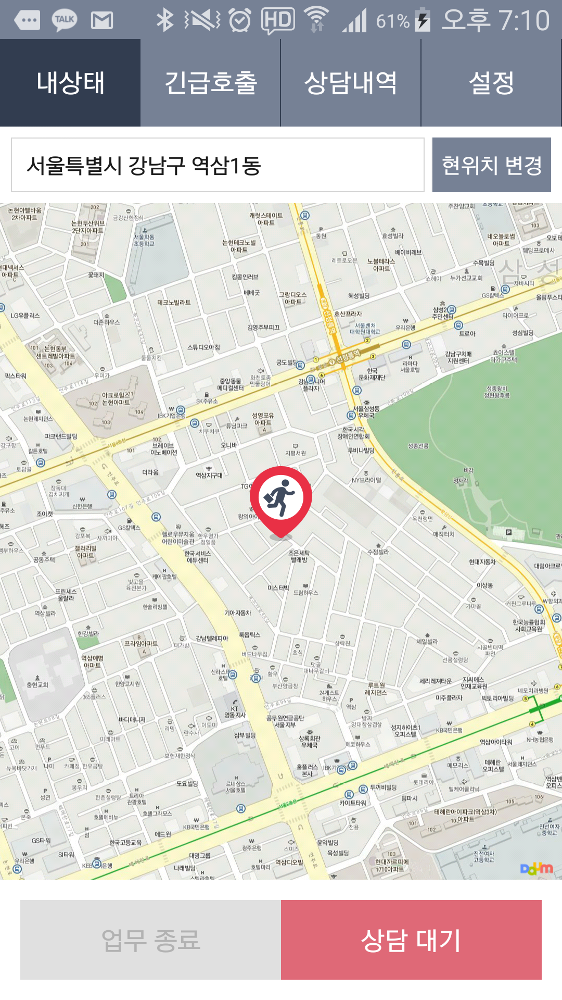

# 연락처
- tel : +82-010-6852-4254
- email : pparkppark84@gmail.com

# 경력기술서

## Momnpick(맘픽)
유아동 쇼핑 어그리게이션 서비스
- 기간 : 2014/12 ~ 2015/11
- 소속회사명 : (주)모바일마루
- 발주처 : (주)모바일마루
- 역할 : 맘픽 안드로이드 앱 전담 개발 및 서버 지원
- 사용기술 : Android Java, butterKnife, AUIL, volley, crashlytics, etc.
- IDE/Build : Android Studio, Gradle, Eclipse(Lagacy)
- [PlayStore](https://play.google.com/store/apps/details?id=com.momnpick)
- [Web](http://www.momnpick.com)

## 모바일래퍼
기존 모바일 소호몰을 안드로이드 앱으로 래핑하여 푸시 서비스 및 배너 서비스 제공하는 앱
- 기간 : 2015/9
- 소속회사명 : (주)모바일마루
- 발주처 : (주)모바일마루
- 역할 : 모바일 래퍼 안드로이드 앱 전담 개발 및 어드민 센터 기획
- 사용기술 : Android Java, butterKnife, picasso, realm, retrofit, etc.
- IDE/Build : Android Studio, Gradle
- 

## 7Km FitBand
스마트밴드를 이용하여 금융상품 가입자에게 리워드를 제공하는 서비스
- 기간 2015/9~2015/10
- 소속회사명 : (주)모바일마루
- 발주처 : (주)Epp Asset
- 역할 : 7Km FitBand 안드로이드 앱 전담 개발 및 미밴드 sdk 개발
- 사용기술 : Android Java, Bluetooth Low Energy, daum map sdk, gps, kakao sdk, retrofit, realm, volley, etc.
- IDE/Build : Android Studio, Gradle
- 

## 오변호사
긴급상황의 경우 변호사를 호출하거나 상담예약을 할 수 있는 서비스
- 기간 : 2015/10~2015/11
- 소속회사명 : (주)모바일마루
- 발주처 : (주)500V
- 역할 : 오변호사 변호사용, 일반 사용자용 앱 전담 개발
- 사용기술 : Android Java, kakao sdk, daum map sdk, gps, retrofit, realm, picasso, butterKnife, etc.
- IDE/Build : Android Studio, Gradle
- 
- 

## ActionPainting (액션페인팅)
유아 교육용 색칠 프로그램
- 기간 : 2014/3~2014/11
- 소속회사명 : (주)스마트앤미디어
- 발주처 : (주)스마트스터디
- 역할 : 액션페인팅 안드로이드, 아이폰 전담개발
- 사용기술 : cocos2d-x, Android Java(JNI), Objective-C, etc.
- IDE/Build : Visual Studio, Eclipse, XCode
- [Play Store](https://play.google.com/store/apps/details?id=com.smartnmedia.ActionPainting)
- [Play Store](https://play.google.com/store/apps/details?id=com.smartnmedia.ActionPainting.BoBo)

## Moca Wallet
KT 전자지갑 모카월렛 유지보수
- 기간 : 2013/2~2013/5
- 소속회사명 : (주)하렉스인포텍
- 발주처 : (주)KT
- 역할 : 모카월렛 유지 보수 및 개발
- 사용기술 : Android Java
- IDE/Build : Eclipse

## MocaPay iOS/Android
전자 결제 어플리케이션
- 기간 : 2013/5~2013/10
- 소속회사명 : (주)하렉스인포텍
- 발주처 : (주)하렉스인포텍
- 역할 : 모카페이(현 UBPay) 아이폰 버전 전담개발 및 안드로이드 버전 지원
- 사용기술 : Objective-C, Android Java
- IDE/Build : Eclipse
- [Play Store](https://play.google.com/store/apps/details?id=com.harex.android.ubpay)
- [App Store](https://itunes.apple.com/kr/app/id424564679)

## 하렉스 복합결제 시스템
KT 포인트와 협약사 포인트를 계산 서버
- 기간 : 2013/5~2013/10
- 소속회사명 : (주)하렉스인포텍
- 발주처 : (주)KT
- 역할 : KT 포인트와 협약사 포인트를 사용해 사용자에게 할인 정보를 알려주는 서비스 서버 유지보수
- 사용기술 : Java, Linux, Oracle, etc.
- IDE/Build : Eclipse, Ant

## 하렉스 POS 시스템
PC용 POS 프로그램
- 기간 : 2013/2~2013/5
- 소속회사명 : (주)하렉스인포텍
- 발주처 : (주)하렉스인포텍
- 역할 : 결제 시스템과 연동할 POS 단말기 프로그램 개발 및 유지보수
- 사용기술 : Delphi, Serial 통신을 통한 프린터 장비 구동
- IDE/Build, Delphi6, Boland C++, Visual Studio

## Atlan Android
아틀란 네비게이션의 안드로이드(휴대폰)버전  
- 기간 : 2011/8~2012/2
- 소속회사명 : (주)맵퍼스
- 발주처 : (주)맵퍼스
- 역할 : Native Interface 구현 및 UI 전담, 이미지 압축 해제 알고리즘 구현
- 사용기술 : Android Java(JNI), NDK, OpenGL2.0, etc.
- IDE/Build : Eclipse, cygwin, Visual Studio
- [Play Store](https://play.google.com/store/apps/details?id=kr.mappers.AtlanSmart)

## Atlan 3DA
아틀란 네비게이션의 안드로이드(단말기)버전 
- 기간 : 2010/11~2011/8
- 소속회사명 : (주)맵퍼스
- 발주처 : (주)파인디지털
- 역할 : Native Interface 구현 및 UI 전담, 이미지 압축 해제 알고리즘 구현
- 사용기술 : Android Java(JNI), NDK, OpenGL2.0, etc.
- IDE/Build : Eclipse, cygwin, Visual Studio

## E-Book Publisher
전자책 변환 및 편집 프로그램
- 기간 : 2009/12~2010/9
- 소속회사명 : (주)에프데스크
- 발주처 : (주)에프데스크
- 역할 : 문서들을 플래시 기반의 전자책으로 변환 및 편집을 할 수 있는 프로그램 전담 개발 
- 사용 기술 : Boland C++, Delphi, ActiveX, gcc
- IDE/Build : Boland C++, Delphi, MinGW
- [Web](http://www.fdesk.net) 